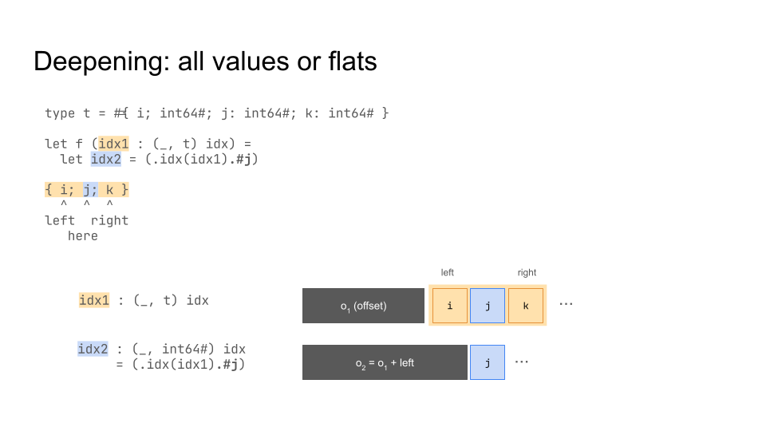
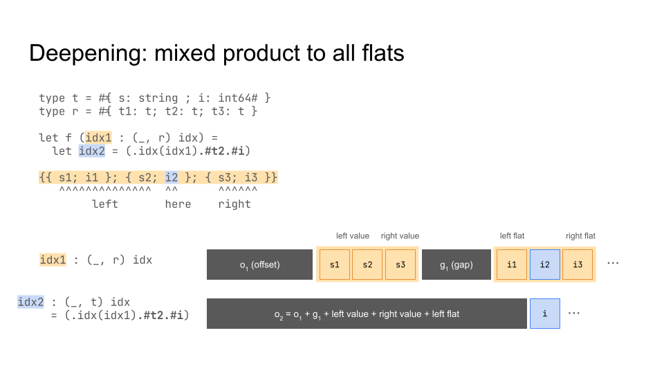
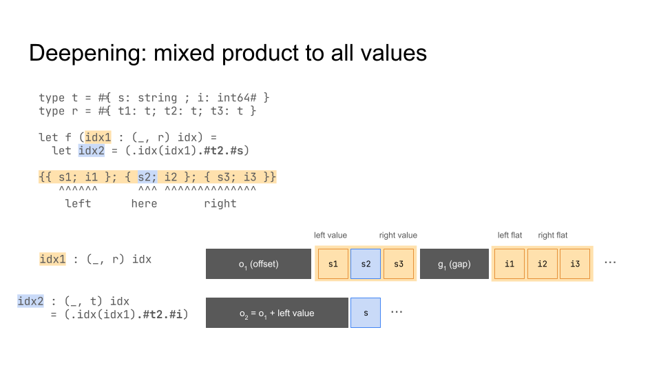
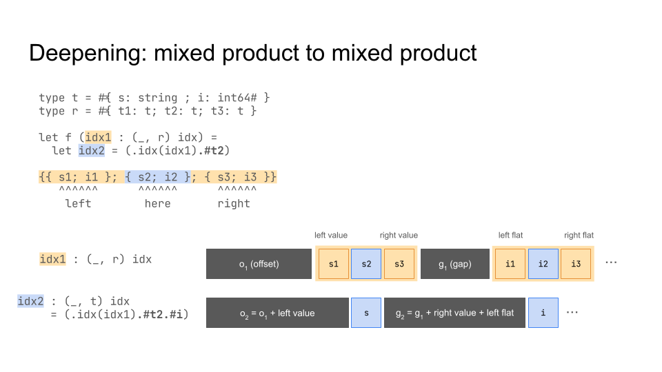

# Representation of block indices

Consider the following type:

```
type a = #{ s : string; i : int64# }
type b = #{ i : int64#; a : a; s : string }
type c = { mutable b : b; s : string }
```
The layout of `c` has the shape
`((b_i64, (a_string, a_i64), b_string), c_string)`,
whose representation differs between the native and bytecode compilers.

In the native code compiler, it gets reordered (a stable two-color sort that
puts values before non-values):
```
   a_string b_string c_string b_i64 a_i64
b  ^^^^^^^^^^^^^^^^^          ^^^^^^^^^^^
a  ^^^^^^^^                         ^^^^^
```

In the bytecode compiler, unboxed records are actually boxed, and not
reordered.

Acccordingly, block indices have also two different representations. In the
native compiler, they are the offset into the block and the gap between the
values and non-values of the pointed-to payload, both in bytes. In the
bytecode compiler, block indices are represented as a sequence of field
positions.

```
Idx in [c]    Native repr.      Bytecode repr.
---------------------------------------------
`(.b)`        offset 0, gap 8   { 0 }
`(.s)`        offset 16, gap 0  { 1 }
`(.b.#i)`     offset 24, gap 0  { 0; 0 }
`(.b.#a)`     offset 0, gap 24  { 0; 1 }
`(.b.#s)`     offset 8, gap 0   { 0; 2 }
`(.b.#a.#s)`  offset 0, gap 0   { 0; 1; 0 }
`(.b.#a.#i)`  offset 32, gap 0  { 0; 1; 1 }
```
| Idx in [c] | Native repr. | Bytecode repr. |
|------------|--------------|----------------|
| `(.b)` | offset 0, gap 8 | { 0 } |
| `(.s)` | offset 16, gap 0 | { 1 } |
| `(.b.#i)` | offset 24, gap 0 | { 0; 0 } |
| `(.b.#a)` | offset 0, gap 24 | { 0; 1 } |
| `(.b.#s)` | offset 8, gap 0 | { 0; 2 } |
| `(.b.#a.#s)` | offset 0, gap 0 | { 0; 1; 0 } |
| `(.b.#a.#i)` | offset 32, gap 0 | { 0; 1; 1 } |


In-memory representation:
- In the native compiler, the offset and gap are packed into
  a single `bits64`. There are two subcases:
  * The index is to product containing both values and non-values. In this
    case, the offset is the lower 48 bits and the gap is the upper 16 bits.
  * The index is to all values/non-values. In this case, all 64 bits are used
    for the offset.
- In the bytecode compiler, the field positions are stored as tagged integers
  in single block with tag 0.
  * Unboxed record fields in the index into singleton unboxed records are
    _not_ included in the list of positions, as singleton unboxed records are
    erased during translation to lambda.

For a visualization of the native representation of block indices, and the
implementation of deepening, see 





